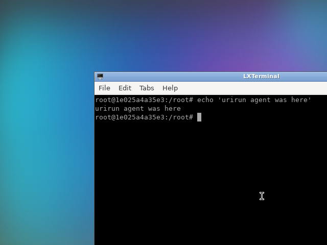

# 28 — an LLM drives a real noVNC desktop from a natural-language intent

You write an intent in plain language; an LLM is given the **typed schema of every
available command** and picks the commands *and fills their parameters*; urirun runs
them against a **noVNC desktop in Docker**; and the session is recorded — plan,
per-step results, screenshots, and an OCR-checked verdict on whether the intent was
realized.

```txt
NL: "open a terminal and run a command printing 'urirun agent was here', then screenshot"
        │
        ▼
   action space  =  6 routes, each WITH its input JSON Schema
        │            (text:string, enter:boolean, command:string, …)
        ▼
   schema-aware LLM planner  ──►  [{uri, payload filled per schema, why}]
        │
        ▼
   urirun executes against the Docker desktop (xdotool / ffmpeg via docker exec)
        │
        ▼
   generated/session-report.md  +  screenshot  +  verdict (OCR-confirmed)
```

## Run it

```bash
python3 run_session.py                       # uses urirun/.env (OpenRouter via liteLLM)
GOAL="open a terminal and type 'hi', enter" python3 run_session.py
```

Needs Docker; it pulls `dorowu/ubuntu-desktop-lxde-vnc` on first run. Without an API
key it falls back to a deterministic planner so the example still runs.

## What actually happened (recorded live)

NL goal: *"Open a terminal on the desktop and run a command that prints 'urirun agent
was here', then take a screenshot of the result."* — planner: **llm**
(`openrouter/qwen/qwen3.7-plus`), action space: 6 typed routes.

| # | URI | ok | payload (LLM-filled **from the schema**) |
|---|-----|----|------------------------------------------|
| 0 | `desktop://novnc/session/command/start` | ✓ | `{}` |
| 1 | `desktop://novnc/app/command/launch` | ✓ | `{"command": "lxterminal"}` |
| 2 | `desktop://novnc/input/command/type` | ✓ | `{"text": "echo 'urirun agent was here'", "enter": true}` |
| 3 | `desktop://novnc/screen/query/screenshot` | ✓ | `{"name": "result_screenshot"}` |
| 4 | `desktop://novnc/session/command/stop` | ✓ | `{}` |



The terminal shows `echo 'urirun agent was here'` → `urirun agent was here`.

**Verdict: YES** — every step ran, a screenshot was captured, and OCR confirmed the
typed text is on screen. The full record is `generated/session-report.md` + `.json`.

## The questions this example answers

### How does the LLM get the schema and pick a command + parameters?

`urirun.runtime.agent.action_space(registry)` now includes each route's **full input
JSON Schema** (`schema`), not just field names. The planner hands that catalog to the
model; the model returns `{uri, payload}` where `payload` satisfies the schema (types,
`required`, defaults, enums). That is the whole mechanism — the LLM never guesses field
names because it is shown the contract. It is the *same* JSON Schema urirun already
projects to **MCP tools** (`urirun.runtime.v2_mcp.to_mcp_tools`), so a model with native
tool-calling can use urirun routes as typed tools with no custom planner at all.

### Is a simpler adaptation of urirun for an LLM possible?

Yes — three levels, cheapest first:

1. **MCP server** — `urirun … mcp serve` exposes every route as an MCP tool (name +
   inputSchema). Point Claude/any MCP client at it; tool-calling does the rest. No code.
2. **Schema-aware planner** (this example) — one `(goal, action_space) -> steps`
   function. Good when you want one plan, `$ref` threading, and your own policy gate.
3. **Decision loop** — call the planner after each step with the prior results, for
   tasks where the next action depends on what just appeared on screen.

### What belongs in urirun core, and what in a connector?

| In **core** (general, done) | In a **connector** (domain I/O, separate) |
|-----------------------------|-------------------------------------------|
| `action_space` carrying each route's inputSchema | `novnc_connector` — Docker / `xdotool` / `ffmpeg` desktop control |
| `$ref:<step>.<field>` threading in `run_plan` | the route shapes (`type`, `key`, `screenshot`, …) and their schemas |
| policy gate (`--allow`, query-vs-command) | how a screenshot is actually grabbed, how text is actually typed |
| MCP / A2A projection of the schema | which Docker image, ports, readiness |

The rule: **core learns to *describe and route* typed capabilities; a connector
*implements* one capability.** Driving a desktop is squarely connector territory — the
only core change this whole example needed was putting the schema in the action space.

## Files

- `novnc_connector/core.py` — the separate connector: typed `@handler` routes driving
  a noVNC Docker desktop (`start`/`launch`/`type`/`key`/`screenshot`/`stop`).
- `schema_planner.py` — schema-aware planner (LLM via liteLLM, offline heuristic fallback).
- `run_session.py` — plan → execute on the desktop → screenshots → report + verdict.
- `test_novnc_session.py` — offline (schema + param-filling) + opt-in live
  (`URIRUN_NOVNC_LIVE=1`) desktop run.
- `docs/result_screenshot.png` — the recorded session result.
