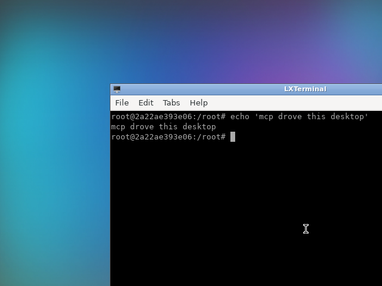

# 29 — the desktop as MCP tools: an LLM drives it with native tool-calling

Example 28 used a custom `(goal, space) -> steps` planner. This one removes the planner
entirely: urirun projects the noVNC connector's routes to **MCP tools** (name +
inputSchema), the model is handed those tools, and it **decides which to call and with
what arguments** via native tool-calling — a decision loop where the next call depends
on the previous result, exactly like a Claude/MCP client.

```txt
desktop connector routes ──► MCP tools (name + JSON Schema)  [zero extra code]
        │
        ▼
   tool-calling loop:  model → tool_call → urirun executes on the desktop → result → model → …
        │
        ▼
   generated/mcp-session-report.md  +  screenshot  +  verdict
```

## Run it

```bash
./mcp_serve.sh                         # show the MCP tools/list + A2A card (no LLM)
python3 mcp_agent.py                    # the model drives the desktop via tool-calling
```

`mcp_agent.py` needs Docker and a **tool-capable** model (default
`openrouter/openai/gpt-4o-mini`; override with `URIRUN_MCP_MODEL`). The configured
`LLM_MODEL` in `urirun/.env` is an image model and does **not** support tool use — hence
the separate default here.

## What actually happened (recorded live)

NL goal: *"On the desktop, open a terminal and run a command that prints 'mcp drove
this desktop', then take a screenshot. Stop the session when done."* — the model called
the tools itself, filling each call's arguments from the tool's JSON Schema:

| # | tool → uri | ok | arguments (model-filled) |
|---|------------|----|--------------------------|
| 0 | `desktop_novnc_session_command_start` → `…/session/command/start` | ✓ | `{}` |
| 1 | `desktop_novnc_app_command_launch` → `…/app/command/launch` | ✓ | `{"command": "lxterminal"}` |
| 2 | `desktop_novnc_input_command_type` → `…/input/command/type` | ✓ | `{"text": "echo 'mcp drove this desktop'", "enter": true}` |
| 3 | `desktop_novnc_screen_query_screenshot` → `…/screen/query/screenshot` | ✓ | `{"name": "screenshot"}` |
| 4 | `desktop_novnc_session_command_stop` → `…/session/command/stop` | ✓ | `{}` |



The terminal shows `echo 'mcp drove this desktop'` → `mcp drove this desktop`.
**Intention realized: YES** — every tool call succeeded and the screenshot was captured.
Full record: `generated/mcp-session-report.md` + `.json`.

## Why this is the simplest LLM adaptation

There is **no planner and no prompt engineering of a plan format** — the model uses its
built-in tool-calling. urirun already supplies the only thing MCP needs: each route as
a tool with a JSON-Schema `parameters` object (`v2_mcp.to_mcp_tools`). So:

- `./mcp_serve.sh` shows `urirun … mcp tools` (tools/list) and the A2A card — the
  zero-code surface. Point any MCP client (Claude Desktop, etc.) at
  `python3 -m urirun.v2_mcp serve <registry> --execute` and it can call these tools.
- `mcp_agent.py` runs that client loop in-process via liteLLM: `to_mcp_tools` →
  function tools → execute each call with `v2_mcp.call_tool` (which goes through the
  same policy-gated `urirun.run`).

## MCP tool names carry the operation

`v2_mcp.tool_name` builds the name from **all** URI path segments, so the operation is
always in the name: `…/session/command/start` → `desktop_novnc_session_command_start`,
`…/screen/query/screenshot` → `desktop_novnc_screen_query_screenshot`. (Earlier it used
only resource+verb and dropped the operation — that was fixed alongside this example.)
Combined with each tool's description (the route label) and JSON-Schema parameters, tool
selection is unambiguous.

## Core vs connector (unchanged from 28)

Nothing new in core was needed for this example — the MCP projection
(`v2_mcp.to_mcp_tools` / `serve_mcp`) and the schema-in-action-space already existed.
The desktop driver stays a **connector**; core just *describes and routes* it.

## Files

- `mcp_agent.py` — MCP-style tool-calling loop driving the desktop (liteLLM).
- `mcp_serve.sh` — `urirun mcp tools` + A2A card; how to run the stdio MCP server.
- `test_mcp_agent.py` — offline (tools + schema + index) + opt-in live (`URIRUN_NOVNC_LIVE=1`).
- `docs/screenshot.png` — the recorded session result.
- Reuses the `novnc_connector` from `../28-llm-novnc-desktop`.
