# System Architecture Analysis
<!-- generated in 0.00s -->

## Overview

- **Project**: /home/tom/github/if-uri/examples
- **Primary Language**: json
- **Languages**: json: 49, python: 19, shell: 14, javascript: 11, yml: 5
- **Analysis Mode**: static
- **Total Functions**: 348
- **Total Classes**: 13
- **Modules**: 125
- **Entry Points**: 191

## Architecture by Module

### 10-device_mesh_lab.www.app
- **Functions**: 99
- **File**: `app.js`

### 10-device_mesh_lab.controller
- **Functions**: 28
- **Classes**: 1
- **File**: `controller.py`

### 06-html_uri_app.app
- **Functions**: 27
- **File**: `app.js`

### 10-device_mesh_lab.device_agent
- **Functions**: 23
- **Classes**: 1
- **File**: `device_agent.py`

### 05-generators.c.example
- **Functions**: 21
- **File**: `example.c`

### 06-html_uri_app.backend
- **Functions**: 18
- **Classes**: 1
- **File**: `backend.py`

### 11-novnc_lan_flow.computer.browser_node
- **Functions**: 17
- **Classes**: 1
- **File**: `browser_node.py`

### 09-docker_uri_flow.orchestrator.flow_runner
- **Functions**: 16
- **File**: `flow_runner.py`

### 12-full_e2e_connect_lab.scripts.connector_checks
- **Functions**: 15
- **File**: `connector_checks.py`

### 09-docker_uri_flow.node-worker.server
- **Functions**: 11
- **File**: `server.js`

### 13-simple_defaults.js.defaults
- **Functions**: 10
- **File**: `defaults.mjs`

### 05-generators.js.uri-command
- **Functions**: 8
- **File**: `uri-command.mjs`

### 07-transports.transport_lib
- **Functions**: 8
- **File**: `transport_lib.py`

### 10-device_mesh_lab.mesh_env
- **Functions**: 7
- **File**: `mesh_env.py`

### 12-full_e2e_connect_lab.registry-runtime.registry_server
- **Functions**: 7
- **Classes**: 1
- **File**: `registry_server.py`

### 09-docker_uri_flow.python-worker.server
- **Functions**: 7
- **Classes**: 1
- **File**: `server.py`

### 11-novnc_lan_flow.orchestrator.run_flow
- **Functions**: 6
- **File**: `run_flow.py`

### 05-generators.ts.decorators
- **Functions**: 5
- **Classes**: 1
- **File**: `decorators.ts`

### 09-docker_uri_flow.shell-worker.server
- **Functions**: 5
- **Classes**: 1
- **File**: `server.py`

### 12-full_e2e_connect_lab.scripts.run_full_scenario
- **Functions**: 4
- **File**: `run_full_scenario.sh`

## Key Entry Points

Main execution flows into the system:

### scripts.build_site.md
- **Calls**: None.split, len, None.join, html.escape, re.sub, re.sub, re.sub, ln.startswith

### 12-full_e2e_connect_lab.scripts.assert_results.main
- **Calls**: Path, 12-full_e2e_connect_lab.scripts.assert_results.load, 12-full_e2e_connect_lab.scripts.assert_results.load, 12-full_e2e_connect_lab.scripts.assert_results.load, 12-full_e2e_connect_lab.scripts.assert_results.load, 12-full_e2e_connect_lab.scripts.assert_results.load, 12-full_e2e_connect_lab.scripts.assert_results.load, None.read_text

### 10-device_mesh_lab.device_agent.DeviceAgent.handler
- **Calls**: 10-device_mesh_lab.mesh_env.send_json, 10-device_mesh_lab.mesh_env.check_auth, 10-device_mesh_lab.mesh_env.send_json, 10-device_mesh_lab.mesh_env.send_json, agent.log, self._authorized, 10-device_mesh_lab.mesh_env.send_json, 10-device_mesh_lab.mesh_env.send_json

### 12-full_e2e_connect_lab.scripts.connector_checks.main
- **Calls**: 12-full_e2e_connect_lab.scripts.connector_checks.fetch_catalog, 12-full_e2e_connect_lab.scripts.connector_checks.write_json, 12-full_e2e_connect_lab.scripts.connector_checks.build_registry, 12-full_e2e_connect_lab.scripts.connector_checks.run_connector_routes, 12-full_e2e_connect_lab.scripts.connector_checks.project_mcp_a2a, 12-full_e2e_connect_lab.scripts.connector_checks.test_grpc_transport, 12-full_e2e_connect_lab.scripts.connector_checks.summarize_catalog, 12-full_e2e_connect_lab.scripts.connector_checks.write_json

### 08-multi_transport.worker.serve_http
- **Calls**: 12-full_e2e_connect_lab.scripts.run_full_scenario.print, None.serve_forever, None.encode, self.send_response, self.send_header, self.send_header, self.end_headers, self.wfile.write

### 10-device_mesh_lab.device_agent.DeviceAgent.dispatch
- **Calls**: urllib.parse.urlparse, self.safe_command, self.open_browser, parsed.path.split, self.device_card, len, str, self.append_note

### 10-device_mesh_lab.device_agent.DeviceAgent.open_browser_in_novnc
- **Calls**: self.browser_target, None.rstrip, 10-device_mesh_lab.device_agent.build_novnc_browser_command, detail.update, terminal_result.get, detail.update, self.log, self.log

### 10-device_mesh_lab.controller.Handler.do_POST
- **Calls**: 10-device_mesh_lab.mesh_env.send_json, 10-device_mesh_lab.mesh_env.read_json, None.strip, 10-device_mesh_lab.controller.nl_flow, 10-device_mesh_lab.mesh_env.send_json, 10-device_mesh_lab.mesh_env.read_json, 10-device_mesh_lab.controller.discover_mesh, 12-full_e2e_connect_lab.scripts.connector_checks.build_registry

### 11-novnc_lan_flow.computer.browser_node.Handler.do_POST
- **Calls**: int, str, time.perf_counter, round, 11-novnc_lan_flow.computer.browser_node.json_response, json.loads, 11-novnc_lan_flow.computer.browser_node.json_response, isinstance

### 06-html_uri_app.backend.Handler.do_GET
- **Calls**: urlparse, self.serve_static, 11-novnc_lan_flow.computer.browser_node.json_response, 11-novnc_lan_flow.computer.browser_node.json_response, int, 11-novnc_lan_flow.computer.browser_node.json_response, 11-novnc_lan_flow.computer.browser_node.json_response, 11-novnc_lan_flow.computer.browser_node.json_response

### 07-transports.scan_and_run.main
- **Calls**: argparse.ArgumentParser, parser.add_argument, parser.add_argument, parser.add_argument, parser.add_argument, parser.add_argument, parser.add_argument, parser.parse_args

### 07-transports.transport_lib.run_via
- **Calls**: ValueError, 07-transports.transport_lib.run_inprocess, 07-transports.transport_lib.run_queue, 07-transports.transport_lib.serverless_handler, reglib.translate, 07-transports.transport_lib.start_http_worker, json.dumps, v2_grpc.serve

### 06-html_uri_app.backend.Handler.serve_static
- **Calls**: None.resolve, path.read_bytes, self.send_response, self.send_header, self.send_header, self.end_headers, self.wfile.write, request_path.lstrip

### 06-html_uri_app.backend.dispatch
- **Calls**: str, bool, 06-html_uri_app.backend.add_log, body.get, body.get, bool, 06-html_uri_app.backend.env_bool, run_uri

### 13-simple_defaults.js.defaults.connector
- **Calls**: 13-simple_defaults.js.defaults.replaceAll, 13-simple_defaults.js.defaults.includes, 13-simple_defaults.js.defaults.replace, 13-simple_defaults.js.defaults.command, 13-simple_defaults.js.defaults.fullUri, 13-simple_defaults.js.defaults.fromEntries, 13-simple_defaults.js.defaults.keys, 13-simple_defaults.js.defaults.map

### 10-device_mesh_lab.device_agent.DeviceAgent.routes
- **Calls**: self.browser_target, 10-device_mesh_lab.device_agent.object_schema, 10-device_mesh_lab.device_agent.object_schema, 10-device_mesh_lab.device_agent.object_schema, 10-device_mesh_lab.device_agent.object_schema, 10-device_mesh_lab.device_agent.object_schema, 10-device_mesh_lab.device_agent.object_schema, 10-device_mesh_lab.device_agent.object_schema

### 11-novnc_lan_flow.orchestrator.run_flow.main
- **Calls**: GENERATED.mkdir, sorted, 11-novnc_lan_flow.orchestrator.run_flow.collect_routes, None.write_text, 12-full_e2e_connect_lab.scripts.run_full_scenario.print, 11-novnc_lan_flow.orchestrator.run_flow.wait_health, 11-novnc_lan_flow.orchestrator.run_flow.run_step, timeline.append

### 10-device_mesh_lab.www.app.runSelectedRoute
- **Calls**: 10-device_mesh_lab.www.app.reportValidity, 10-device_mesh_lab.www.app.payloadFromForm, 10-device_mesh_lab.www.app.showJson, 10-device_mesh_lab.www.app.String, 10-device_mesh_lab.www.app.recordActivity, 10-device_mesh_lab.www.app.targetFromUri, 10-device_mesh_lab.www.app.runUri, 10-device_mesh_lab.www.app.appendTimeline

### 09-docker_uri_flow.shell-worker.server.Handler.do_POST
- **Calls**: int, 09-docker_uri_flow.shell-worker.server.dispatch, 10-device_mesh_lab.www.app.response, 10-device_mesh_lab.www.app.response, json.loads, str, self.headers.get, None.decode

### 09-docker_uri_flow.python-worker.server.Handler.do_POST
- **Calls**: int, 09-docker_uri_flow.shell-worker.server.dispatch, 10-device_mesh_lab.www.app.response, 10-device_mesh_lab.www.app.response, json.loads, str, self.headers.get, None.decode

### 10-device_mesh_lab.www.app.runNlFlow
- **Calls**: 10-device_mesh_lab.www.app.trim, 10-device_mesh_lab.www.app.recordActivity, 10-device_mesh_lab.www.app.showJson, 10-device_mesh_lab.www.app.fetch, 10-device_mesh_lab.www.app.stringify, 10-device_mesh_lab.www.app.json, 10-device_mesh_lab.www.app.appendTimeline, 10-device_mesh_lab.www.app.refreshDevices

### 12-full_e2e_connect_lab.registry-runtime.registry_server.send
- **Calls**: None.encode, handler.send_response, handler.send_header, handler.send_header, handler.send_header, handler.end_headers, handler.wfile.write, str

### 10-device_mesh_lab.controller.main
- **Calls**: 10-device_mesh_lab.mesh_env.load_env, os.getenv, int, ThreadingHTTPServer, 12-full_e2e_connect_lab.scripts.run_full_scenario.print, server.serve_forever, os.getenv, json.dumps

### 06-html_uri_app.backend.Handler.do_POST
- **Calls**: self.read_body, 11-novnc_lan_flow.computer.browser_node.json_response, 11-novnc_lan_flow.computer.browser_node.json_response, 11-novnc_lan_flow.computer.browser_node.json_response, 06-html_uri_app.backend.add_log, 11-novnc_lan_flow.computer.browser_node.json_response, 09-docker_uri_flow.shell-worker.server.dispatch, 06-html_uri_app.backend.dispatch_tool

### 06-html_uri_app.backend.main
- **Calls**: 06-html_uri_app.backend.load_env, os.getenv, int, range, 06-html_uri_app.backend.add_log, 12-full_e2e_connect_lab.scripts.run_full_scenario.print, server.serve_forever, os.getenv

### 05-generators.php.example.UriCommand.bindingFromFunction
- **Calls**: 05-generators.php.example.ReflectionFunction, 05-generators.php.example.getAttributes, 05-generators.php.example.newInstance, 05-generators.php.example.foreach, 05-generators.php.example.getParameters, 05-generators.php.example.UriCommand.schemaType, 05-generators.php.example.isDefaultValueAvailable, 05-generators.php.example.getDefaultValue

### 09-docker_uri_flow.shell-worker.server.response
- **Calls**: None.encode, handler.send_response, handler.send_header, handler.send_header, handler.end_headers, handler.wfile.write, str, json.dumps

### 12-full_e2e_connect_lab.registry-runtime.registry_server.Handler.do_GET
- **Calls**: 09-docker_uri_flow.node-worker.server.send, 12-full_e2e_connect_lab.registry-runtime.registry_server.discover, 09-docker_uri_flow.node-worker.server.send, 09-docker_uri_flow.node-worker.server.send, 09-docker_uri_flow.node-worker.server.send, 12-full_e2e_connect_lab.registry-runtime.registry_server.registry_document, len, len

### 10-device_mesh_lab.device_agent.DeviceAgent.processes
- **Calls**: subprocess.run, proc.stdout.splitlines, line.split, rows.append, len, len, name.lower, command_name.lower

### 09-docker_uri_flow.python-worker.server.response
- **Calls**: None.encode, handler.send_response, handler.send_header, handler.send_header, handler.end_headers, handler.wfile.write, str, json.dumps

## Process Flows

Key execution flows identified:

### Flow 1: md
```
md [scripts.build_site]
```

### Flow 2: main
```
main [12-full_e2e_connect_lab.scripts.assert_results]
  └─> load
  └─> load
```

### Flow 3: handler
```
handler [10-device_mesh_lab.device_agent.DeviceAgent]
  └─ →> send_json
  └─ →> check_auth
      └─> auth_token
```

### Flow 4: serve_http
```
serve_http [08-multi_transport.worker]
  └─ →> print
```

### Flow 5: dispatch
```
dispatch [10-device_mesh_lab.device_agent.DeviceAgent]
```

### Flow 6: open_browser_in_novnc
```
open_browser_in_novnc [10-device_mesh_lab.device_agent.DeviceAgent]
  └─ →> build_novnc_browser_command
```

### Flow 7: do_POST
```
do_POST [10-device_mesh_lab.controller.Handler]
  └─ →> send_json
  └─ →> read_json
  └─ →> nl_flow
      └─> discover_mesh
          └─> discover_device
          └─ →> parse_peers
```

### Flow 8: do_GET
```
do_GET [06-html_uri_app.backend.Handler]
  └─ →> json_response
  └─ →> json_response
```

### Flow 9: run_via
```
run_via [07-transports.transport_lib]
  └─> run_inprocess
  └─> run_queue
```

### Flow 10: serve_static
```
serve_static [06-html_uri_app.backend.Handler]
```

## Key Classes

### 10-device_mesh_lab.device_agent.DeviceAgent
- **Methods**: 16
- **Key Methods**: 10-device_mesh_lab.device_agent.DeviceAgent.__init__, 10-device_mesh_lab.device_agent.DeviceAgent.log, 10-device_mesh_lab.device_agent.DeviceAgent.recent_logs, 10-device_mesh_lab.device_agent.DeviceAgent.append_note, 10-device_mesh_lab.device_agent.DeviceAgent.routes, 10-device_mesh_lab.device_agent.DeviceAgent.device_card, 10-device_mesh_lab.device_agent.DeviceAgent.browser_target, 10-device_mesh_lab.device_agent.DeviceAgent.installable, 10-device_mesh_lab.device_agent.DeviceAgent.processes, 10-device_mesh_lab.device_agent.DeviceAgent.safe_command

### 10-device_mesh_lab.controller.Handler
- **Methods**: 5
- **Key Methods**: 10-device_mesh_lab.controller.Handler.__init__, 10-device_mesh_lab.controller.Handler.end_headers, 10-device_mesh_lab.controller.Handler.do_OPTIONS, 10-device_mesh_lab.controller.Handler.do_GET, 10-device_mesh_lab.controller.Handler.do_POST
- **Inherits**: SimpleHTTPRequestHandler

### 06-html_uri_app.backend.Handler
- **Methods**: 5
- **Key Methods**: 06-html_uri_app.backend.Handler.log_message, 06-html_uri_app.backend.Handler.do_GET, 06-html_uri_app.backend.Handler.do_POST, 06-html_uri_app.backend.Handler.read_body, 06-html_uri_app.backend.Handler.serve_static
- **Inherits**: BaseHTTPRequestHandler

### 05-generators.php.example.UriCommand
- **Methods**: 4
- **Key Methods**: 05-generators.php.example.UriCommand.__construct, 05-generators.php.example.UriCommand.schemaType, 05-generators.php.example.UriCommand.bindingFromFunction, 05-generators.php.example.UriCommand.slug

### 11-novnc_lan_flow.computer.browser_node.Handler
- **Methods**: 4
- **Key Methods**: 11-novnc_lan_flow.computer.browser_node.Handler.log_message, 11-novnc_lan_flow.computer.browser_node.Handler.do_OPTIONS, 11-novnc_lan_flow.computer.browser_node.Handler.do_GET, 11-novnc_lan_flow.computer.browser_node.Handler.do_POST
- **Inherits**: BaseHTTPRequestHandler

### 09-docker_uri_flow.shell-worker.server.Handler
- **Methods**: 3
- **Key Methods**: 09-docker_uri_flow.shell-worker.server.Handler.log_message, 09-docker_uri_flow.shell-worker.server.Handler.do_GET, 09-docker_uri_flow.shell-worker.server.Handler.do_POST
- **Inherits**: BaseHTTPRequestHandler

### 09-docker_uri_flow.python-worker.server.Handler
- **Methods**: 3
- **Key Methods**: 09-docker_uri_flow.python-worker.server.Handler.log_message, 09-docker_uri_flow.python-worker.server.Handler.do_GET, 09-docker_uri_flow.python-worker.server.Handler.do_POST
- **Inherits**: BaseHTTPRequestHandler

### 12-full_e2e_connect_lab.registry-runtime.registry_server.Handler
- **Methods**: 2
- **Key Methods**: 12-full_e2e_connect_lab.registry-runtime.registry_server.Handler.do_GET, 12-full_e2e_connect_lab.registry-runtime.registry_server.Handler.log_message
- **Inherits**: BaseHTTPRequestHandler

### 05-generators.ts.decorators.MathCommands
- **Methods**: 1
- **Key Methods**: 05-generators.ts.decorators.MathCommands.add

### 05-generators.go.example.Field
- **Methods**: 0

### 05-generators.go.example.InputSchema
- **Methods**: 0

### 05-generators.go.example.Binding
- **Methods**: 0

### 05-generators.go.example.Document
- **Methods**: 0

## Data Transformation Functions

Key functions that process and transform data:

### 10-device_mesh_lab.www.app.processes

### 10-device_mesh_lab.www.app.parsePayloadValue
- **Output to**: 10-device_mesh_lab.www.app.parseInt, 10-device_mesh_lab.www.app.parseFloat, 10-device_mesh_lab.www.app.trim, 10-device_mesh_lab.www.app.parse

### 09-docker_uri_flow.orchestrator.flow_runner.parse_scalar
- **Output to**: value.strip, len

### 09-docker_uri_flow.orchestrator.flow_runner.parse_flow
- **Output to**: None.splitlines, raw.rstrip, line.strip, None.read_text, None.startswith

### 09-docker_uri_flow.orchestrator.flow_runner.validate_flow_registry
- **Output to**: RuntimeError, 09-docker_uri_flow.orchestrator.flow_runner.registry_route_count, 09-docker_uri_flow.orchestrator.flow_runner.registry_has_uri

### 07-transports.transport_lib.run_inprocess
- **Output to**: v2.run

### 10-device_mesh_lab.mesh_env.parse_peers
- **Output to**: None.strip, raw.startswith, raw.split, json.loads, item.split

### 10-device_mesh_lab.device_agent.parse_browser_targets
- **Output to**: None.strip, 10-device_mesh_lab.device_agent.default_browser_targets, raw.startswith, raw.split, json.loads

### 10-device_mesh_lab.device_agent.DeviceAgent.processes
- **Output to**: subprocess.run, proc.stdout.splitlines, line.split, rows.append, len

### 10-device_mesh_lab.controller.postprocess_flow
- **Output to**: sorted, prompt.lower, any, any, 10-device_mesh_lab.controller.is_safe_route

## Behavioral Patterns

### state_machine_Handler
- **Type**: state_machine
- **Confidence**: 0.70
- **Functions**: 12-full_e2e_connect_lab.registry-runtime.registry_server.Handler.do_GET, 12-full_e2e_connect_lab.registry-runtime.registry_server.Handler.log_message

## Public API Surface

Functions exposed as public API (no underscore prefix):

- `scripts.build_site.md` - 62 calls
- `12-full_e2e_connect_lab.scripts.assert_results.main` - 60 calls
- `12-full_e2e_connect_lab.scripts.connector_checks.run_connector_routes` - 47 calls
- `12-full_e2e_connect_lab.scripts.connector_checks.build_registry` - 38 calls
- `10-device_mesh_lab.controller.normalize_flow` - 35 calls
- `11-novnc_lan_flow.computer.browser_node.app_service_call` - 35 calls
- `10-device_mesh_lab.device_agent.DeviceAgent.handler` - 32 calls
- `12-full_e2e_connect_lab.scripts.connector_checks.main` - 30 calls
- `09-docker_uri_flow.orchestrator.flow_runner.parse_flow` - 26 calls
- `10-device_mesh_lab.device_agent.parse_browser_targets` - 26 calls
- `11-novnc_lan_flow.computer.browser_node.screenshot_page` - 26 calls
- `08-multi_transport.worker.serve_http` - 25 calls
- `10-device_mesh_lab.device_agent.DeviceAgent.dispatch` - 25 calls
- `07-transports.transport_lib.start_http_worker` - 24 calls
- `10-device_mesh_lab.device_agent.DeviceAgent.open_browser_in_novnc` - 24 calls
- `10-device_mesh_lab.controller.Handler.do_POST` - 24 calls
- `11-novnc_lan_flow.computer.browser_node.Handler.do_POST` - 23 calls
- `06-html_uri_app.backend.Handler.do_GET` - 21 calls
- `10-device_mesh_lab.controller.fallback_steps` - 19 calls
- `07-transports.scan_and_run.main` - 16 calls
- `09-docker_uri_flow.orchestrator.flow_runner.run_flow` - 16 calls
- `07-transports.transport_lib.run_via` - 16 calls
- `10-device_mesh_lab.controller.execute_flow` - 15 calls
- `06-html_uri_app.backend.Handler.serve_static` - 15 calls
- `12-full_e2e_connect_lab.scripts.connector_checks.test_grpc_transport` - 14 calls
- `10-device_mesh_lab.mesh_env.parse_peers` - 14 calls
- `10-device_mesh_lab.device_agent.make_agent_from_env` - 14 calls
- `06-html_uri_app.backend.dispatch` - 14 calls
- `13-simple_defaults.js.defaults.connector` - 13 calls
- `10-device_mesh_lab.device_agent.DeviceAgent.routes` - 13 calls
- `11-novnc_lan_flow.computer.browser_node.route_call` - 13 calls
- `06-html_uri_app.backend.dispatch_tool` - 13 calls
- `10-device_mesh_lab.mesh_env.send_json` - 12 calls
- `11-novnc_lan_flow.orchestrator.run_flow.main` - 12 calls
- `10-device_mesh_lab.controller.postprocess_flow` - 12 calls
- `11-novnc_lan_flow.computer.browser_node.json_response` - 12 calls
- `10-device_mesh_lab.www.app.renderRoutes` - 11 calls
- `10-device_mesh_lab.www.app.renderPayloadForm` - 11 calls
- `10-device_mesh_lab.www.app.refreshDevices` - 11 calls
- `10-device_mesh_lab.www.app.runSelectedRoute` - 11 calls

## System Interactions

How components interact:

```mermaid
graph TD
    md --> split
    md --> len
    md --> join
    md --> escape
    md --> sub
    main --> Path
    main --> load
    handler --> send_json
    handler --> check_auth
    handler --> log
    main --> fetch_catalog
    main --> write_json
    main --> build_registry
    main --> run_connector_routes
    main --> project_mcp_a2a
    serve_http --> print
    serve_http --> serve_forever
    serve_http --> encode
    serve_http --> send_response
    serve_http --> send_header
    dispatch --> urlparse
    dispatch --> safe_command
    dispatch --> open_browser
    dispatch --> split
    dispatch --> device_card
    open_browser_in_novn --> browser_target
    open_browser_in_novn --> rstrip
    open_browser_in_novn --> build_novnc_browser_
    open_browser_in_novn --> update
    open_browser_in_novn --> get
```



## Reverse Engineering Guidelines

1. **Entry Points**: Start analysis from the entry points listed above
2. **Core Logic**: Focus on classes with many methods
3. **Data Flow**: Follow data transformation functions
4. **Process Flows**: Use the flow diagrams for execution paths
5. **API Surface**: Public API functions reveal the interface

## Context for LLM

Maintain the identified architectural patterns and public API surface when suggesting changes.