# System Architecture Analysis
<!-- generated in 0.01s -->

## Overview

- **Project**: /home/tom/github/if-uri/examples
- **Primary Language**: python
- **Languages**: python: 118, json: 118, yaml: 50, shell: 44, javascript: 11
- **Analysis Mode**: static
- **Total Functions**: 994
- **Total Classes**: 27
- **Modules**: 404
- **Entry Points**: 474

## Architecture by Module

### 10-device_mesh_lab.www.app
- **Functions**: 99
- **File**: `app.js`

### 33-office-automation-mcp.office_system
- **Functions**: 34
- **File**: `office_system.py`

### 52-office-vm-rdp-novnc.vm_office_system
- **Functions**: 29
- **File**: `vm_office_system.py`

### 10-device_mesh_lab.controller
- **Functions**: 28
- **Classes**: 1
- **File**: `controller.py`

### 39-local-social-autonomy.autonomous_browser
- **Functions**: 28
- **Classes**: 2
- **File**: `autonomous_browser.py`

### 06-html_uri_app.app
- **Functions**: 27
- **File**: `app.js`

### 10-device_mesh_lab.device_agent
- **Functions**: 23
- **Classes**: 1
- **File**: `device_agent.py`

### 05-generators.c.example
- **Functions**: 21
- **File**: `example.c`

### 44-chat-prompt-sweep.run_chat_prompts
- **Functions**: 19
- **File**: `run_chat_prompts.py`

### 06-html_uri_app.backend
- **Functions**: 19
- **Classes**: 1
- **File**: `backend.py`

### 39-local-social-autonomy.scout
- **Functions**: 19
- **Classes**: 2
- **File**: `scout.py`

### 40-local-portals-suite.portal_server
- **Functions**: 18
- **Classes**: 2
- **File**: `portal_server.py`

### 11-novnc_lan_flow.computer.browser_node
- **Functions**: 17
- **Classes**: 1
- **File**: `browser_node.py`

### 35-deploy-lenovo-surface.lenovo_node
- **Functions**: 17
- **File**: `lenovo_node.py`

### 39-local-social-autonomy.uri_runtime
- **Functions**: 17
- **File**: `uri_runtime.py`

### 09-docker_uri_flow.orchestrator.flow_runner
- **Functions**: 16
- **File**: `flow_runner.py`

### 12-full_e2e_connect_lab.scripts.connector_checks
- **Functions**: 16
- **File**: `connector_checks.py`

### 39-local-social-autonomy.mock_linkedin
- **Functions**: 16
- **Classes**: 2
- **File**: `mock_linkedin.py`

### 40-local-portals-suite.portal_autonomy
- **Functions**: 15
- **File**: `portal_autonomy.py`

### 36-remote-browser-cdp.unattended_browser
- **Functions**: 15
- **File**: `unattended_browser.py`

## Key Entry Points

Main execution flows into the system:

### 43-camera-usb-ocr-inspection.run.main
- **Calls**: argparse.ArgumentParser, ap.add_argument, ap.add_argument, ap.add_argument, ap.parse_args, tempfile.mkdtemp, 43-camera-usb-ocr-inspection.run._value, os.path.join

### 31-llm-remote-office.office_agent.main
- **Calls**: argparse.ArgumentParser, ap.add_argument, ap.add_argument, ap.add_argument, ap.add_argument, ap.add_argument, ap.parse_args, 31-llm-remote-office.office_agent.load_env

### 32-task-scenarios.nl_scenario.main
- **Calls**: 32-task-scenarios.nl_scenario._load_env, rs.Node, os.environ.get, 29-mcp-desktop-agent.mcp_serve.print, 29-mcp-desktop-agent.mcp_serve.print, 32-task-scenarios.nl_scenario.llm_steps, 32-task-scenarios.nl_scenario._slug, 32-task-scenarios.nl_scenario.to_yaml

### scripts.build_site.md
- **Calls**: None.split, len, None.join, html.escape, re.sub, re.sub, re.sub, ln.startswith

### 12-full_e2e_connect_lab.scripts.assert_results.main
- **Calls**: Path, 12-full_e2e_connect_lab.scripts.assert_results.load, 12-full_e2e_connect_lab.scripts.assert_results.load, 12-full_e2e_connect_lab.scripts.assert_results.load, 12-full_e2e_connect_lab.scripts.assert_results.load, 12-full_e2e_connect_lab.scripts.assert_results.load, 12-full_e2e_connect_lab.scripts.assert_results.load, None.read_text

### 36-remote-browser-cdp.drive_cdp.main
- **Calls**: 29-mcp-desktop-agent.mcp_serve.print, 36-remote-browser-cdp.drive_cdp.cdp, 36-remote-browser-cdp.drive_cdp.value, 29-mcp-desktop-agent.mcp_serve.print, bool, time.sleep, 36-remote-browser-cdp.drive_cdp.cdp, 29-mcp-desktop-agent.mcp_serve.print

### ifuri-033-email-spam.run_local.main
- **Calls**: ifuri-033-email-spam.run_local._profiles, int, ifuri-033-email-spam.run_local._inbox_mboxes, ifuri-033-email-spam.run_local._read_messages, 29-mcp-desktop-agent.mcp_serve.print, 29-mcp-desktop-agent.mcp_serve.print, ifuri-033-email-spam.run_local._classify, checkpoint.record

### 44-ksef-token-via-browser.run_token_capture.main
- **Calls**: 29-mcp-desktop-agent.mcp_serve.print, bc.cdp_launch, 29-mcp-desktop-agent.mcp_serve.print, input, kt.build_login_check_js, range, 29-mcp-desktop-agent.mcp_serve.print, bc.cdp_navigate

### 52-office-vm-rdp-novnc.run.main
- **Calls**: argparse.ArgumentParser, p.add_argument, p.add_argument, p.add_argument, p.add_argument, p.parse_args, 52-office-vm-rdp-novnc.run.load_registry, 52-office-vm-rdp-novnc.run.mcp_tools

### 28-llm-novnc-desktop.run_session.main
- **Calls**: OUT.mkdir, novnc.registry, agent.action_space, schema_planner.plan, agent.run_plan, next, any, all

### 34-all-connectors-flow.run.main
- **Calls**: argparse.ArgumentParser, p.add_argument, p.add_argument, p.parse_args, 34-all-connectors-flow.run._ensure_connector_imports, 34-all-connectors-flow.run.write_flow, urirun.compile_registry, 34-all-connectors-flow.run.merged_registry

### scripts.run_ci_manifest.main
- **Calls**: argparse.ArgumentParser, parser.add_argument, parser.add_argument, parser.add_argument, parser.add_argument, parser.add_argument, parser.add_argument, parser.add_argument

### 32-task-scenarios.aggregate_report.main
- **Calls**: sorted, sum, sum, sum, sorted, out.write_text, 29-mcp-desktop-agent.mcp_serve.print, GEN.glob

### 33-office-automation-mcp.run.main
- **Calls**: argparse.ArgumentParser, p.add_argument, p.add_argument, p.add_argument, p.parse_args, 33-office-automation-mcp.run.load_registry, 33-office-automation-mcp.run.mcp_tools, all

### 47-nl-desktop-control.run.main
- **Calls**: argparse.ArgumentParser, ap.add_argument, ap.add_argument, ap.add_argument, ap.add_argument, ap.add_argument, ap.add_argument, ap.parse_args

### 15-llm-yaml-repair.agent_repair.main
- **Calls**: argparse.ArgumentParser, parser.add_argument, parser.add_argument, parser.add_argument, parser.add_argument, parser.add_argument, parser.add_argument, parser.add_argument

### 23-llm-flow-repair.repair_flow_mesh.main
- **Calls**: argparse.ArgumentParser, ap.add_argument, ap.add_argument, ap.add_argument, ap.add_argument, ap.add_argument, ap.add_argument, ap.add_argument

### ifuri-033-email-spam.run.main
- **Calls**: None.lower, ifuri-033-email-spam.run._resolve_creds, folders_query_list, 29-mcp-desktop-agent.mcp_serve.print, inbox_query_list, message_query_classify, 29-mcp-desktop-agent.mcp_serve.print, ifuri-033-email-spam.run._print_spam

### 32-task-scenarios.host_node_matrix.main
- **Calls**: argparse.ArgumentParser, parser.add_argument, parser.add_argument, parser.add_argument, parser.parse_args, set, set, tuple

### scripts.audit_ecosystem_coverage.main
- **Calls**: argparse.ArgumentParser, parser.add_argument, parser.add_argument, parser.add_argument, parser.add_argument, parser.add_argument, parser.add_argument, parser.add_argument

### 12-full_e2e_connect_lab.scripts.connector_checks.main
- **Calls**: 12-full_e2e_connect_lab.scripts.connector_checks.fetch_catalog, 12-full_e2e_connect_lab.scripts.connector_checks.selected_connector_ids, 12-full_e2e_connect_lab.scripts.connector_checks.write_json, 12-full_e2e_connect_lab.scripts.connector_checks.build_registry, 12-full_e2e_connect_lab.scripts.connector_checks.run_connector_routes, 12-full_e2e_connect_lab.scripts.connector_checks.project_mcp_a2a, 12-full_e2e_connect_lab.scripts.connector_checks.test_grpc_transport, 12-full_e2e_connect_lab.scripts.connector_checks.summarize_catalog

### 39-local-social-autonomy.nl_autonomy.planner
> Planner contract used by `urirun agent run`: (goal, action_space) -> steps.
- **Calls**: 39-local-social-autonomy.nl_autonomy._nl_key, any, any, autonomous_browser.route_uri, next, next, next, re.search

### ifuri-039-signal-reply.run.main
- **Calls**: None.strip, core.messages_query_inbox, inbox.get, 29-mcp-desktop-agent.mcp_serve.print, core.message_command_reply, reply.get, 29-mcp-desktop-agent.mcp_serve.print, core.messages_query_list

### 37-closed-loop-automation.run.main
- **Calls**: NodeClient, 15-llm-yaml-repair.agent_repair.make_llm_planner, 37-closed-loop-automation.planners.make_llm_decider, None.strftime, sess.mkdir, 29-mcp-desktop-agent.mcp_serve.print, 29-mcp-desktop-agent.mcp_serve.print, closed_loop.self_repair_loop

### 20-runtime-transport-matrix.matrix.main
- **Calls**: check_all.setup_polyglot_bin, list, 29-mcp-desktop-agent.mcp_serve.print, 29-mcp-desktop-agent.mcp_serve.print, 29-mcp-desktop-agent.mcp_serve.print, 29-mcp-desktop-agent.mcp_serve.print, 29-mcp-desktop-agent.mcp_serve.print, urirun.compile_registry

### 21-generate-from-binding.generate.main
- **Calls**: sys.path.insert, urirun.compile_registry, list, out_dir.mkdir, None.write_text, None.write_text, None.write_text, 29-mcp-desktop-agent.mcp_serve.print

### 14-llm-uri-agent.agent.main
- **Calls**: argparse.ArgumentParser, parser.add_argument, parser.add_argument, parser.add_argument, parser.add_argument, parser.parse_args, 14-llm-uri-agent.agent.load_registry, 14-llm-uri-agent.agent.action_space

### 31-llm-remote-office.build_node_registry.main
- **Calls**: argparse.ArgumentParser, ap.add_argument, ap.add_argument, ap.parse_args, Path, out.mkdir, tellmesh_bridge.build_bindings, bpath.write_text

### 45-ksef-send-faktura.send_invoice.main
- **Calls**: os.getenv, os.getenv, 45-ksef-send-faktura.send_invoice.send, 29-mcp-desktop-agent.mcp_serve.print, 29-mcp-desktop-agent.mcp_serve.print, 29-mcp-desktop-agent.mcp_serve.print, plan.get, 29-mcp-desktop-agent.mcp_serve.print

### ifuri-229-executor-escalation.run.main
- **Calls**: ifuri-229-executor-escalation.run._install_mock, 29-mcp-desktop-agent.mcp_serve.print, 29-mcp-desktop-agent.mcp_serve.print, goal.send_via_kvm, 29-mcp-desktop-agent.mcp_serve.print, 29-mcp-desktop-agent.mcp_serve.print, 29-mcp-desktop-agent.mcp_serve.print, result.get

## Process Flows

Key execution flows identified:

### Flow 1: main
```
main [43-camera-usb-ocr-inspection.run]
```

### Flow 2: md
```
md [scripts.build_site]
```

## Key Classes

### 10-device_mesh_lab.device_agent.DeviceAgent
- **Methods**: 16
- **Key Methods**: 10-device_mesh_lab.device_agent.DeviceAgent.__init__, 10-device_mesh_lab.device_agent.DeviceAgent.log, 10-device_mesh_lab.device_agent.DeviceAgent.recent_logs, 10-device_mesh_lab.device_agent.DeviceAgent.append_note, 10-device_mesh_lab.device_agent.DeviceAgent.routes, 10-device_mesh_lab.device_agent.DeviceAgent.device_card, 10-device_mesh_lab.device_agent.DeviceAgent.browser_target, 10-device_mesh_lab.device_agent.DeviceAgent.installable, 10-device_mesh_lab.device_agent.DeviceAgent.processes, 10-device_mesh_lab.device_agent.DeviceAgent.safe_command

### 40-local-portals-suite.portal_server.PortalHandler
- **Methods**: 13
- **Key Methods**: 40-local-portals-suite.portal_server.PortalHandler.state, 40-local-portals-suite.portal_server.PortalHandler.log_message, 40-local-portals-suite.portal_server.PortalHandler._portal, 40-local-portals-suite.portal_server.PortalHandler._send, 40-local-portals-suite.portal_server.PortalHandler._redirect, 40-local-portals-suite.portal_server.PortalHandler._form, 40-local-portals-suite.portal_server.PortalHandler._session_id, 40-local-portals-suite.portal_server.PortalHandler._authenticated, 40-local-portals-suite.portal_server.PortalHandler.do_GET, 40-local-portals-suite.portal_server.PortalHandler.do_POST
- **Inherits**: BaseHTTPRequestHandler

### 39-local-social-autonomy.autonomous_browser.CDPBrowser
- **Methods**: 12
- **Key Methods**: 39-local-social-autonomy.autonomous_browser.CDPBrowser.__init__, 39-local-social-autonomy.autonomous_browser.CDPBrowser.base, 39-local-social-autonomy.autonomous_browser.CDPBrowser._json, 39-local-social-autonomy.autonomous_browser.CDPBrowser._connect, 39-local-social-autonomy.autonomous_browser.CDPBrowser._open_ws, 39-local-social-autonomy.autonomous_browser.CDPBrowser._send_ws, 39-local-social-autonomy.autonomous_browser.CDPBrowser._read_exact, 39-local-social-autonomy.autonomous_browser.CDPBrowser._recv_ws, 39-local-social-autonomy.autonomous_browser.CDPBrowser.command, 39-local-social-autonomy.autonomous_browser.CDPBrowser.eval

### 39-local-social-autonomy.mock_linkedin.MockLinkedInHandler
- **Methods**: 11
- **Key Methods**: 39-local-social-autonomy.mock_linkedin.MockLinkedInHandler.state, 39-local-social-autonomy.mock_linkedin.MockLinkedInHandler.log_message, 39-local-social-autonomy.mock_linkedin.MockLinkedInHandler._send, 39-local-social-autonomy.mock_linkedin.MockLinkedInHandler._redirect, 39-local-social-autonomy.mock_linkedin.MockLinkedInHandler._form, 39-local-social-autonomy.mock_linkedin.MockLinkedInHandler._session_id, 39-local-social-autonomy.mock_linkedin.MockLinkedInHandler._authenticated, 39-local-social-autonomy.mock_linkedin.MockLinkedInHandler.do_GET, 39-local-social-autonomy.mock_linkedin.MockLinkedInHandler.do_POST, 39-local-social-autonomy.mock_linkedin.MockLinkedInHandler._login
- **Inherits**: BaseHTTPRequestHandler

### 39-local-social-autonomy.scout.AttachCDP
> Minimal CDP client that attaches to a running Chrome over /json.
- **Methods**: 10
- **Key Methods**: 39-local-social-autonomy.scout.AttachCDP.__init__, 39-local-social-autonomy.scout.AttachCDP._json, 39-local-social-autonomy.scout.AttachCDP.connect, 39-local-social-autonomy.scout.AttachCDP._send, 39-local-social-autonomy.scout.AttachCDP._recv_exact, 39-local-social-autonomy.scout.AttachCDP._recv, 39-local-social-autonomy.scout.AttachCDP.command, 39-local-social-autonomy.scout.AttachCDP.eval, 39-local-social-autonomy.scout.AttachCDP.scroll_down, 39-local-social-autonomy.scout.AttachCDP.close

### 06-html_uri_app.backend.Handler
- **Methods**: 5
- **Key Methods**: 06-html_uri_app.backend.Handler.log_message, 06-html_uri_app.backend.Handler.do_GET, 06-html_uri_app.backend.Handler.do_POST, 06-html_uri_app.backend.Handler.read_body, 06-html_uri_app.backend.Handler.serve_static
- **Inherits**: BaseHTTPRequestHandler

### 10-device_mesh_lab.controller.Handler
- **Methods**: 5
- **Key Methods**: 10-device_mesh_lab.controller.Handler.__init__, 10-device_mesh_lab.controller.Handler.end_headers, 10-device_mesh_lab.controller.Handler.do_OPTIONS, 10-device_mesh_lab.controller.Handler.do_GET, 10-device_mesh_lab.controller.Handler.do_POST
- **Inherits**: SimpleHTTPRequestHandler

### 31-llm-remote-office.office_agent.Node
- **Methods**: 5
- **Key Methods**: 31-llm-remote-office.office_agent.Node.__init__, 31-llm-remote-office.office_agent.Node.concretize, 31-llm-remote-office.office_agent.Node.action_space, 31-llm-remote-office.office_agent.Node.log, 31-llm-remote-office.office_agent.Node.recent_log
- **Inherits**: NodeClient

### 11-novnc_lan_flow.computer.browser_node.Handler
- **Methods**: 4
- **Key Methods**: 11-novnc_lan_flow.computer.browser_node.Handler.log_message, 11-novnc_lan_flow.computer.browser_node.Handler.do_OPTIONS, 11-novnc_lan_flow.computer.browser_node.Handler.do_GET, 11-novnc_lan_flow.computer.browser_node.Handler.do_POST
- **Inherits**: BaseHTTPRequestHandler

### 05-generators.php.example.UriCommand
- **Methods**: 4
- **Key Methods**: 05-generators.php.example.UriCommand.__construct, 05-generators.php.example.UriCommand.schemaType, 05-generators.php.example.UriCommand.bindingFromFunction, 05-generators.php.example.UriCommand.slug

### 09-docker_uri_flow.shell-worker.server.Handler
- **Methods**: 3
- **Key Methods**: 09-docker_uri_flow.shell-worker.server.Handler.log_message, 09-docker_uri_flow.shell-worker.server.Handler.do_GET, 09-docker_uri_flow.shell-worker.server.Handler.do_POST
- **Inherits**: BaseHTTPRequestHandler

### 09-docker_uri_flow.python-worker.server.Handler
- **Methods**: 3
- **Key Methods**: 09-docker_uri_flow.python-worker.server.Handler.log_message, 09-docker_uri_flow.python-worker.server.Handler.do_GET, 09-docker_uri_flow.python-worker.server.Handler.do_POST
- **Inherits**: BaseHTTPRequestHandler

### 12-full_e2e_connect_lab.registry-runtime.registry_server.Handler
- **Methods**: 2
- **Key Methods**: 12-full_e2e_connect_lab.registry-runtime.registry_server.Handler.do_GET, 12-full_e2e_connect_lab.registry-runtime.registry_server.Handler.log_message
- **Inherits**: BaseHTTPRequestHandler

### 40-local-portals-suite.portal_server.PortalState
- **Methods**: 2
- **Key Methods**: 40-local-portals-suite.portal_server.PortalState.from_env, 40-local-portals-suite.portal_server.PortalState.create_record

### 39-local-social-autonomy.mock_linkedin.MockState
- **Methods**: 2
- **Key Methods**: 39-local-social-autonomy.mock_linkedin.MockState.from_env, 39-local-social-autonomy.mock_linkedin.MockState.publish

### 18-openapi-import.run.Mock
- **Methods**: 2
- **Key Methods**: 18-openapi-import.run.Mock.do_GET, 18-openapi-import.run.Mock.log_message
- **Inherits**: http.server.BaseHTTPRequestHandler

### 05-generators.ts.decorators.MathCommands
- **Methods**: 1
- **Key Methods**: 05-generators.ts.decorators.MathCommands.add

### 32-task-scenarios.run_scenarios.Node
- **Methods**: 1
- **Key Methods**: 32-task-scenarios.run_scenarios.Node.concretize
- **Inherits**: NodeClient

### 05-generators.go.example.Field
- **Methods**: 0

### 05-generators.go.example.InputSchema
- **Methods**: 0

## Data Transformation Functions

Key functions that process and transform data:

### 07-transports.transport_lib.run_inprocess
- **Output to**: v2.run

### 10-device_mesh_lab.mesh_env.parse_peers
- **Output to**: None.strip, raw.startswith, raw.split, json.loads, item.split

### 10-device_mesh_lab.device_agent.parse_browser_targets
- **Output to**: None.strip, 10-device_mesh_lab.device_agent.default_browser_targets, raw.startswith, raw.split, json.loads

### 10-device_mesh_lab.device_agent.DeviceAgent.processes
- **Output to**: subprocess.run, proc.stdout.splitlines, line.split, rows.append, len

### 10-device_mesh_lab.www.app.processes

### 10-device_mesh_lab.www.app.parsePayloadValue
- **Output to**: 10-device_mesh_lab.www.app.parseInt, 10-device_mesh_lab.www.app.parseFloat, 10-device_mesh_lab.www.app.trim, 10-device_mesh_lab.www.app.parse

### 09-docker_uri_flow.orchestrator.flow_runner.parse_scalar
- **Output to**: value.strip, len

### 09-docker_uri_flow.orchestrator.flow_runner.parse_flow
- **Output to**: None.splitlines, raw.rstrip, line.strip, None.read_text, None.startswith

### 09-docker_uri_flow.orchestrator.flow_runner.validate_flow_registry
- **Output to**: RuntimeError, 09-docker_uri_flow.orchestrator.flow_runner.registry_route_count, 09-docker_uri_flow.orchestrator.flow_runner.registry_has_uri

### ifuri-033-email-spam.run_local._decode
- **Output to**: str, make_header, decode_header

### 45-ksef-send-faktura.send_invoice.parse_upo
> Parse the UPO returned by the send (the assigned KSeF number + timestamp) and archive
the raw UPO. T
- **Output to**: inv.ksef_upo

### 40-local-portals-suite.domain_loop.parse_loop_prompt
- **Output to**: 40-local-portals-suite.domain_loop.extract_domain, 40-local-portals-suite.domain_loop.extract_iterations, 40-local-portals-suite.domain_loop.clean_action_prompt

### 39-local-social-autonomy.uri_runtime.parse_uri
> Parse chrome://scout/<command>?<query> into (command, params).
- **Output to**: urllib.parse.urlparse, dict, ValueError, parsed.path.strip, urllib.parse.parse_qsl

### 10-device_mesh_lab.controller.postprocess_flow
- **Output to**: sorted, prompt.lower, any, any, 10-device_mesh_lab.controller.is_safe_route

### scripts.run_ci_manifest.validate_manifest
- **Output to**: scripts.run_ci_manifest.load_manifest, set, set, sorted, sorted

### 39-local-social-autonomy.session_probe.parse_endpoints
> Parse endpoint config from payload or .env.

Accepted endpoint forms:
- `chrome=http://127.0.0.1:922
- **Output to**: mock_linkedin.load_env, enumerate, env.get, 39-local-social-autonomy.session_probe._split_csv, out.append

## Behavioral Patterns

### recursion__eval_text
- **Type**: recursion
- **Confidence**: 0.90
- **Functions**: 44-ksef-token-via-browser.run_token_capture._eval_text

### recursion__contains_degraded
- **Type**: recursion
- **Confidence**: 0.90
- **Functions**: 32-task-scenarios.host_node_matrix._contains_degraded

### recursion_resolve_runtime_placeholders
- **Type**: recursion
- **Confidence**: 0.90
- **Functions**: 06-html_uri_app.backend.resolve_runtime_placeholders

### recursion__find
- **Type**: recursion
- **Confidence**: 0.90
- **Functions**: 47-nl-desktop-control.computer_use._find

### state_machine_Handler
- **Type**: state_machine
- **Confidence**: 0.70
- **Functions**: 12-full_e2e_connect_lab.registry-runtime.registry_server.Handler.do_GET, 12-full_e2e_connect_lab.registry-runtime.registry_server.Handler.log_message

### state_machine_PortalState
- **Type**: state_machine
- **Confidence**: 0.70
- **Functions**: 40-local-portals-suite.portal_server.PortalState.from_env, 40-local-portals-suite.portal_server.PortalState.create_record

### state_machine_MockState
- **Type**: state_machine
- **Confidence**: 0.70
- **Functions**: 39-local-social-autonomy.mock_linkedin.MockState.from_env, 39-local-social-autonomy.mock_linkedin.MockState.publish

## Public API Surface

Functions exposed as public API (no underscore prefix):

- `43-camera-usb-ocr-inspection.run.main` - 98 calls
- `31-llm-remote-office.office_agent.main` - 88 calls
- `32-task-scenarios.nl_scenario.main` - 81 calls
- `33-office-automation-mcp.office_system.bindings` - 77 calls
- `49-linkedin-compose-cdp.run.run_flow` - 69 calls
- `52-office-vm-rdp-novnc.vm_office_system.bindings` - 65 calls
- `scripts.build_site.md` - 62 calls
- `12-full_e2e_connect_lab.scripts.assert_results.main` - 60 calls
- `36-remote-browser-cdp.drive_cdp.main` - 57 calls
- `ifuri-033-email-spam.run_local.main` - 52 calls
- `44-chat-prompt-sweep.run_chat_prompts.summarize` - 49 calls
- `44-chat-prompt-sweep.run_chat_prompts.run` - 48 calls
- `44-chat-prompt-sweep.run_chat_prompts.write_reports` - 47 calls
- `12-full_e2e_connect_lab.scripts.connector_checks.run_connector_routes` - 47 calls
- `44-ksef-token-via-browser.run_token_capture.main` - 46 calls
- `52-office-vm-rdp-novnc.run.main` - 43 calls
- `28-llm-novnc-desktop.run_session.main` - 42 calls
- `34-all-connectors-flow.run.main` - 42 calls
- `scripts.run_ci_manifest.main` - 42 calls
- `32-task-scenarios.aggregate_report.main` - 41 calls
- `33-office-automation-mcp.run.main` - 41 calls
- `scripts.audit_ecosystem_coverage.audit` - 40 calls
- `47-nl-desktop-control.run.main` - 40 calls
- `12-full_e2e_connect_lab.scripts.connector_checks.build_registry` - 38 calls
- `15-llm-yaml-repair.agent_repair.main` - 37 calls
- `23-llm-flow-repair.repair_flow_mesh.main` - 37 calls
- `ifuri-033-email-spam.run.main` - 36 calls
- `32-task-scenarios.host_node_matrix.main` - 36 calls
- `11-novnc_lan_flow.computer.browser_node.app_service_call` - 35 calls
- `40-local-portals-suite.portal_autonomy.run_portal_action` - 35 calls
- `10-device_mesh_lab.controller.normalize_flow` - 35 calls
- `29-mcp-desktop-agent.mcp_agent.run` - 35 calls
- `32-task-scenarios.host_node_matrix.run_node_matrix` - 34 calls
- `39-local-social-autonomy.autonomous_browser.run_autonomy` - 34 calls
- `10-device_mesh_lab.device_agent.DeviceAgent.handler` - 32 calls
- `39-local-social-autonomy.uri_runtime.render_markdown` - 32 calls
- `scripts.audit_ecosystem_coverage.main` - 31 calls
- `12-full_e2e_connect_lab.scripts.connector_checks.main` - 31 calls
- `39-local-social-autonomy.nl_autonomy.planner` - 31 calls
- `ifuri-039-signal-reply.run.main` - 30 calls

## System Interactions

How components interact:

```mermaid
graph TD
    main --> ArgumentParser
    main --> add_argument
    main --> parse_args
    main --> _load_env
    main --> Node
    main --> get
    main --> print
    md --> split
    md --> len
    md --> join
    md --> escape
    md --> sub
    main --> Path
    main --> load
    main --> cdp
    main --> value
    main --> bool
    main --> _profiles
    main --> int
    main --> _inbox_mboxes
    main --> _read_messages
    main --> cdp_launch
    main --> input
    main --> build_login_check_js
    main --> mkdir
    main --> registry
    main --> action_space
    main --> plan
    main --> run_plan
    main --> _ensure_connector_im
```



## Reverse Engineering Guidelines

1. **Entry Points**: Start analysis from the entry points listed above
2. **Core Logic**: Focus on classes with many methods
3. **Data Flow**: Follow data transformation functions
4. **Process Flows**: Use the flow diagrams for execution paths
5. **API Surface**: Public API functions reveal the interface

## Context for LLM

Maintain the identified architectural patterns and public API surface when suggesting changes.